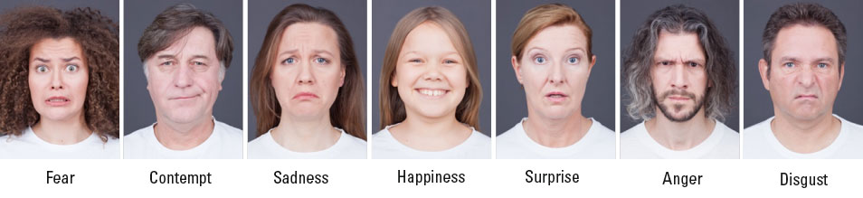
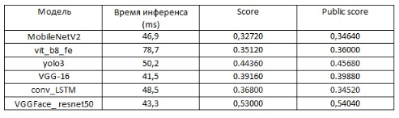

# Распознавание эмоций по выражению лица с помощью компьтерного зрения

## Оглавление

*  [О проекте](https://colab.research.google.com/drive/1NKz3HixkL4ZZEVWR5YH8LsELlry3THoU#scrollTo=ePNLZW1v9rO_).
*   [Реализованные в проекте решения](https://colab.research.google.com/drive/1NKz3HixkL4ZZEVWR5YH8LsELlry3THoU#scrollTo=1Z1LZeWBML_9).
* [Результаты](https://colab.research.google.com/drive/1NKz3HixkL4ZZEVWR5YH8LsELlry3THoU#scrollTo=tjBtUDvPLHGS).
* [Вывод](https://colab.research.google.com/drive/1NKz3HixkL4ZZEVWR5YH8LsELlry3THoU#scrollTo=MtgDj9s0ZwZ4).
* [Использование модели](https://colab.research.google.com/drive/1NKz3HixkL4ZZEVWR5YH8LsELlry3THoU#scrollTo=tpOpcUg5ahfW)

## О проекте
Проект - это дипломная работа курса «Data Scientist. ML. Средний уровень (нейронные сети)». Содержит [соревнование на платформе Kaggle](https://www.kaggle.com/c/skillbox-computer-vision-project), которое заключается в необходимости написать воспроизводимый код, генерирующий csv-файл с ответами. В нём для каждого изображения с лицом человека должна указываться наиболее вероятная эмоция из представленных. Работа требует реализации алгоритма, с помощью которого будет происходить заданная классификация. Разрешается использовать предобученные сети только на датасете ImageNet. Приветствуется использование архитектур свёрточных нейронных сетей, разобранных во время теоретических занятий. Время инференса сети на Google Colab не должно превышать 0,33 секунды (3 кадра в секунду). Дополнительно к заданию использовать модель в небольшом прототипе: брать кадры из веб-камеры, прогонять их через модель, а в окне камеры выводить результат. 

## Реализованные в проекте решения

Были реализованны следующие предобученные на датасете ImageNet сети:

MobileNetV2

vit_b8_fe

yolov3

Свои модели с полным обучением на своих данных:

модель с архитектурой VGG-16

модель с использованием Convolutional LSTM

В качестве дополнения была рассмотрена предобученная на датасете VGGFace модель 

resnet50

В предобученных моделях применена одинаковая структура верхних слоев, использующихся в качестве классификатора.

Решения по каждой модели представлены в соответствующем названии модели ноутбуке. Предварительно нужно выполнить код в ноутбуке "data_analysis_and_creation_of_working_files.ipynb" для создания необходимых для обучения, тестирования и использования модели в прототипе приложений файлов.

## Результаты

## Вывод

Лучший результат по условиям соревнования Kaggle показала модель yolo3 c оценкой Public score - 0.4568 и временем инференса, удовлетворяющем заданию. 

## Использование модели 

Для использования обученной модели в практических задачах я описал ее в классе Сlassifier, который импортируется в "functions.py" скриптe через "from yolo_model import model". Класс содержит два метода:

loading - в нем структура модели загружается из json-файла, после чего в нее загружаются сохраненные веса. 

predict - получает предсказание эмоции. Метод получает на вход предварительно обработанное изображение 224х224 для использования в модели и словарь эмоций.

Для локализации лиц на изображении (фотографии или кадре из видео) используется OpenCV. За визуализацию bounding box вокруг детектированного лица и подпись распознанной эмоции отвечают функции из скрипта "functions.py". Цвет рамки и подписи для каждой эмоции свой. Реализованы прототипы для определения эмоции для изображений, видео и потока кадров из веб-камеры в соответствующих по названию скриптах: 

foto.py

video.py

сamera.py

